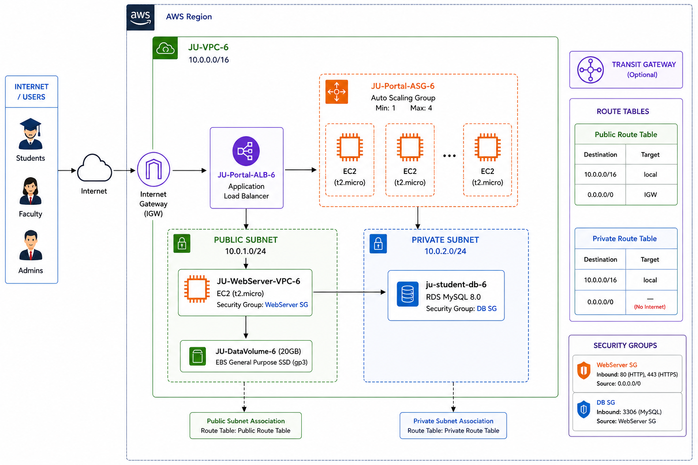

# JU-Cloud-Infrastructure-Project
AWS Cloud Infrastructure for Jamhuriya University

# ☁️ Jamhuriya University Cloud Infrastructure Project

---

## 📖 Project Overview

This project implements a **secure, scalable, and highly available cloud infrastructure** for **Jamhuriya University (JUST)** on Amazon Web Services (AWS). The system replaces the university's outdated on-premises infrastructure with a modern cloud solution that solves critical problems:

| Problem | Solution |
|---------|----------|
| ❌ Server crashes during registration | ✅ Auto Scaling Group (Min:1, Max:4) |
| ❌ No data backup | ✅ RDS automated backups + EBS snapshots |
| ❌ Limited storage | ✅ S3 buckets with lifecycle rules |
| ❌ Poor remote access | ✅ Internet-facing ALB + EC2 in public subnet |
| ❌ Weak security (no MFA) | ✅ IAM with MFA + Private subnet for DB |

**Region:** `af-south-1` (Africa - Cape Town)  
**Project Tag:** `Project: JU-Cloud-System` | `Group: Group-6`

---

## 🏗️ Architecture Diagram

---

## 📋 Lab Implementation Summary

| Lab | Title | Lead Role | Status |
|-----|-------|-----------|--------|
| 1 | AWS Account Setup & Console Familiarization | Cloud Admin | ✅ |
| 2 | Identity and Access Management (IAM) | Security Engineer | ✅ |
| 3 | Launching EC2 Instance | Infrastructure Engineer | ✅ |
| 4 | Amazon S3 Storage Management | Storage Engineer | ✅ |
| 5 | EBS Storage Management | Infrastructure Engineer | ✅ |
| 6 | VPC Networking | Network Engineer | ✅ |
| 7 | RDS Database Deployment | Database Engineer | ✅ |
| 8 | CloudWatch Monitoring | Monitoring Lead | ✅ |
| 9 | Load Balancing & Auto Scaling | Monitoring Lead | ✅ |
| 10 | Final Architecture Verification | All Members | ✅ |

---

## 👥 Team Members - Group 6

| # | Name | ID | Role |
|---|------|-----|------|
| 1 | **Ilyaas Mohamuud Faarah** | C6220168 | Infrastructure Engineer |
| 2 | **Osman Ali Isak** | C6220270 | Security Engineer |
| 3 | **Mohamed Ibraahim Abdi** | C6220072 | Cloud Administrator |
| 4 | **Omar Ali Hassan** | C6620090 | Monitoring & Scaling Lead |
| 5 | **Abdi Kani Mohamed A/lahi** | C6220271 | Security Assistant |
| 6 | **Ibraahim Muxudiin Mohamed** | C6220360 | Storage Engineer |
| 7 | **Shuceyb Ali Ibraahim** | C6220210 | Network Engineer |
| 8 | **Abdi Haliim Abdi Qani Ali** | C6220359 | Database Engineer |

---

## 🛠️ Technology Stack

### Compute & Scaling
- **EC2:** t2.micro instances running Amazon Linux 2
- **Auto Scaling Group:** Min 1, Max 4 instances
- **Launch Template:** Automated Apache web server deployment
- **Application Load Balancer:** Internet-facing, distributes traffic

### Storage
- **EBS:** 20GB gp3 volume mounted at `/ju-data`
- **S3:** Three buckets (lectures, submissions, official docs)
- **Lifecycle Rules:** Archive to Glacier after 90 days
- **Versioning:** Enabled on student submissions

### Database
- **RDS:** MySQL 8.0 (db.t3.micro)
- **Private Subnet:** No direct internet access
- **Security Group:** Only EC2 can connect (port 3306)

### Networking
- **VPC:** 10.0.0.0/16 with public/private subnets
- **Internet Gateway:** For public subnet access
- **Route Tables:** Public (0.0.0.0/0 → IGW), Private (no internet)

### Security & Monitoring
- **IAM:** Custom users, groups, and policies
- **MFA:** Enabled on admin accounts
- **CloudWatch:** CPU alarms (>70%), server down alarms
- **SNS:** Email alerts for IT team

---

## 🚀 Quick Start

### Prerequisites
- AWS Account (Free Tier)
- IAM user with appropriate permissions
- Git installed

